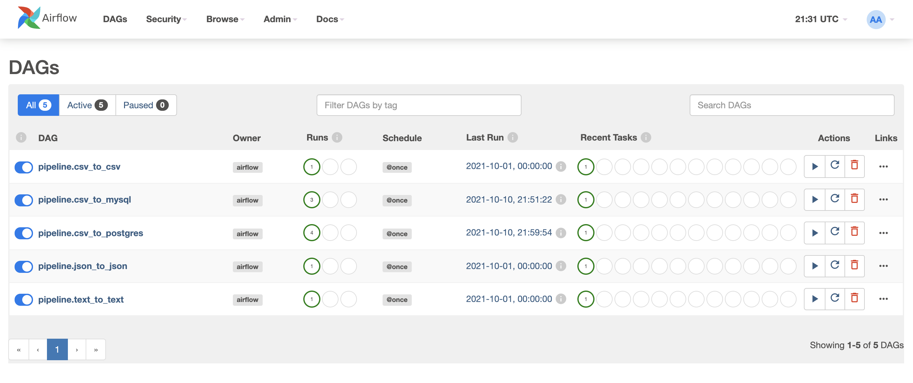
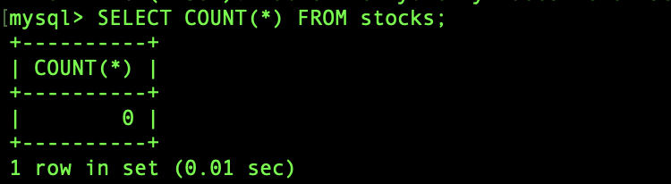
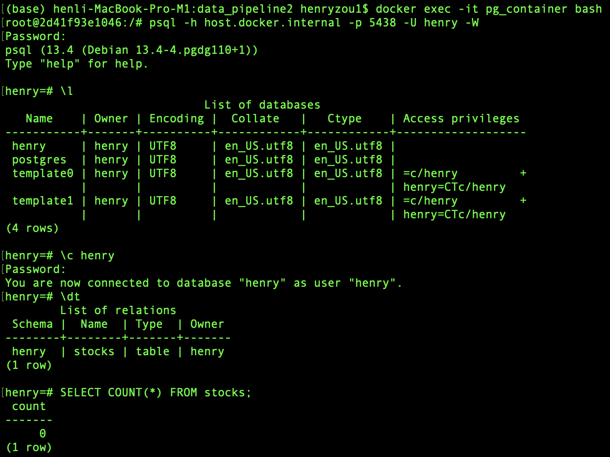
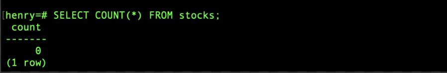

<!-- TABLE OF CONTENTS -->
<details>
  <summary>Table of Contents</summary>
  <ol>
    <li>
      <a href="#about-the-project">About The Project</a>
      <ul>
        <li><a href="#built-with">Built With</a></li>
      </ul>
    </li>
    <li>
      <a href="#getting-started">Getting Started</a>
      <ul>
        <li><a href="#prerequisites">Prerequisites</a></li>
        <li><a href="#installation">Installation</a></li>
      </ul>
    </li>
    <li><a href="#usage">Usage</a></li>
    <li><a href="#howto">HowTo</a></li>
    <li><a href="#license">License</a></li>
    <li><a href="#contact">Contact</a></li>
  </ol>
</details>


<!-- About The Project -->
## About The Project


The goal for this project is to demnostrate the process of ETL automation using **Airflow**, **Docker Containers** and **Python**. 


## Built With
Some major frameworks/libraries used to bootstrap this project:
* [Apache-airflow](https://github.com/apache/airflow): Data pipeline Scheduling and orchestration
* [Docker](https://docs.docker.com/): Isolate application environment inside a container. 
* [Mysql-connector-python](https://dev.mysql.com/doc/connector-python/en/): Used to establish connection with MySQL database
* [Psycopg2-binary](https://pypi.org/project/psycopg2-binary/): Used to establish connection with Postgres database


<!-- GETTING STARTED -->
## Getting Started

### Prerequisites
#### Docker
Make sure you have Docker Desktop installed on your computer. If you do not have Docker installed please use this link to [download](https://www.docker.com/products/docker-desktop):

Once Docker is installed, make sure it is up and running in your background.

Verify that the minimum memory requirements for Docker are set. Use the image below as a reference:


### Running the Application
1. Make sure your docker is running with the minimum requirement highlighted above. 

2. Ensure that you are in the main directory of the project, and then run the following command in the command line:
```bash
make run-app
```

3. Check the table has been created in both MySQL and Postgres Databases by using the following commands:

```bash
docker ps
```


using the following command to access MySQL inside the container:
```bash
docker exec -it ms_container bash
```
and then connected to the MySQL inside the container by using the following:
- host = host.docker.internal
- port = 3307
- user = henry
- passcode = henry
- table name = stocks


here we can see before tirggering the MySQL dag, the table is empty.



3. Check that the application is running by going to your [localhost:8080](http://localhost:8080/)

(Please note that application can take anywhere between 1 - 5 minutes to run depending on your particular system)


3. Login to the Airflow Webserver using the following credentials:
   - username: `henry` 
   - password:`henry`

4. Trigger the DAGs to ensure that they are working properly. 


5. Check the **How To** section for additional instructions.

6. Shut down the application by entering the following command in your terminal:<br>
` make reset`


<!-- How To -->
## How To

### 1. How to verify the Airflow is running


After triggering the dag:


## 3. How to verify the Postgres table is created
```bash
docker exec -it pg_container bash
```
and then connected to the MySQL inside the container by using the following:
- host = host.docker.internal
- port = 5438
- user = henry
- passcode = henry
- table name = stocks



here we can see before tirggering the Postgres dag, the table is empty.


After triggering the dag:


<!--LICENSE -->
## License
Distributed under the MIT License.

<!--Contact-->
## Maintainer
- Primary - [Henry Zou](https://github.com/henryzzz093) 
- Secondary - [Domonique Gordon](https://github.com/DomoniqueGordon)
<p align = "right">(<a href = "#top">back to top</a>)</p> 


