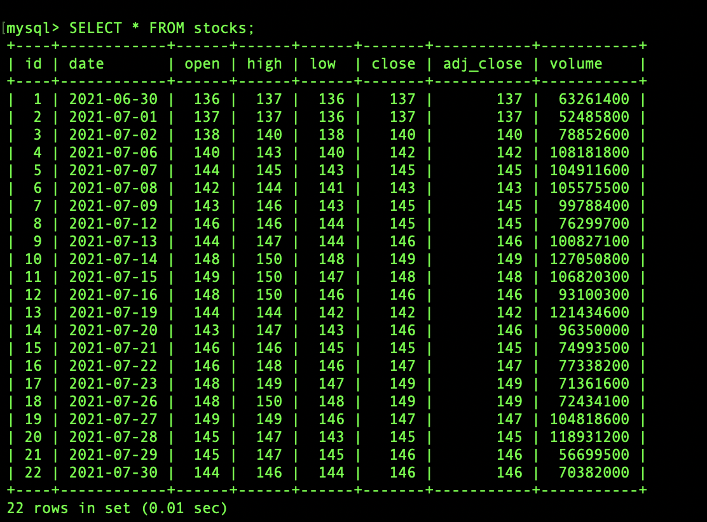
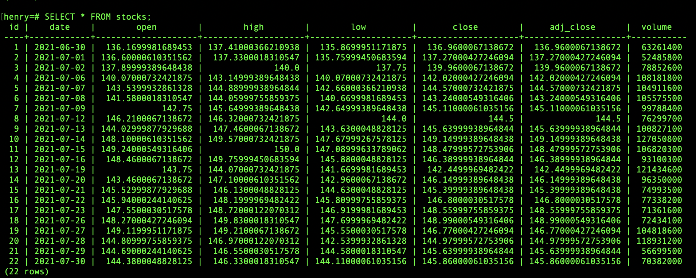

<!-- TABLE OF CONTENTS -->
<details>
  <summary>Table of Contents</summary>
  <ol>
    <li>
      <a href="#about-the-project">About The Project</a>
      <ul>
        <li><a href="#built-with">Built With</a></li>
      </ul>
    </li>
    <li>
      <a href="#getting-started">Getting Started</a>
      <ul>
        <li><a href="#prerequisites">Prerequisites</a></li>
        <li><a href="#installation">Installation</a></li>
      </ul>
    </li>
    <li><a href="#usage">Usage</a></li>
    <li><a href="#howto">HowTo</a></li>
    <li><a href="#license">License</a></li>
    <li><a href="#contact">Contact</a></li>
  </ol>
</details>


<!-- About The Project -->
## About The Project


The goal for this project to demostrate the process of ETL automation using Airflow, Docker containers and Python. 


## Built With
Some major frameworks/libraries used to bootstrap this project:
* [Apache-airflow](https://github.com/apache/airflow)
* [Docker](https://docs.docker.com/)
* [Mysql-connector-python](https://dev.mysql.com/doc/connector-python/en/)
* [Psycopg2-binary](https://pypi.org/project/psycopg2-binary/)


<!-- GETTING STARTED -->
## Getting Started

### Prerequisites
1. make sure your installed Docker Desktop on your computer. You can use the below link to download Docker from this link [download](https://www.docker.com/products/docker-desktop):

2. executing the Docker Desktop and make sure it runs in your background.

3. Some minimum memory requirements for Docker:


4. Make sure your Makefile has the latest version, you can check your current version by typing the following in terminal:
```bash
make --version
GNU Make 4.3
Copyright (C) 1988-2020 Free Software Foundation, Inc.
```
Or you can upgrade your makefile by using:
```bash
brew install make
```
and then add a "gnubin" directoryto your PATH from your bashrc like:
```bash
export PATH="/usr/local/opt/make/libexec/gnubin:$PATH"
```

### Installation

1. using the following commend to run the project without creating a vitural environment:
```bash
make run-app
```
it would install every packages for you as well as creating a Apache Airflow UI to monitor the tasks


2. For those who would like to run the project under development purpose, type:
```bash
make run-app-dev
``` 
to go inside the poetry shell, and then <strong> type the following again </strong>:
```bash
make run-app-dev 
``` 

3. you can reset everything and wipe out the docker images from your computer by using:
```bash
make reset
```

<!-- Usage -->
## Usage
Data Pipeline Demostration

<!-- HowTo -->
## HowTo

### 1. How to verify the Airflow is running
```bash
docker ps
```


### 2. How to verify the MySQL table is created
```bash
docker exec -it ms_container bash
```
and then connected to the MySQL inside the container by using the following:
- host = host.docker.internal
- port = 3307
- user = henry
- passcode = henry
- table name = stocks


here we can see before tirggering the MySQL dag, the table is empty.


After triggering the dag:


## 3. How to verify the Postgres table is created
```bash
docker exec -it pg_container bash
```
and then connected to the MySQL inside the container by using the following:
- host = host.docker.internal
- port = 5438
- user = henry
- passcode = henry
- table name = stocks


here we can see before tirggering the Postgres dag, the table is empty.


After triggering the dag:


<!--LICENSE -->
## License
Distributed under the MIT License.

<!--Contact-->
## Maintainer
- Primary - [Henry Zou](https://github.com/henryzzz093) 
- Secondary - [Domonique Gordon](https://github.com/DomoniqueGordon)
<p align = "right">(<a href = "#top">back to top</a>)</p> 


