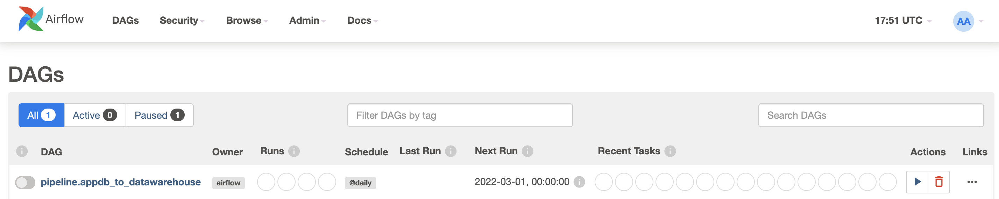

<!-- TABLE OF CONTENTS -->
<details>
  <summary>Table of Contents</summary>
  <ol>
    <li>
      <a href="#about-the-project">About The Project</a>
      <ul>
        <li><a href="#built-with">Built With</a></li>
      </ul>
    </li>
    <li>
      <a href="#getting-started">Getting Started</a>
      <ul>
        <li><a href="#prerequisites">Prerequisites</a></li>
        <li><a href="#Running-the-Application">Runing the Application</a></li>
      </ul>
    </li>
    <li><a href="#usage">Usage</a></li>
    <li><a href="#how-to">How To</a></li>
    <li><a href="#license">License</a></li>
    <li><a href="#Maintainer">Maintainer</a></li>
  </ol>
</details>


<!-- About The Project -->
## About The Project


Study Case:
Imagine that we have an application in charge of collecting customer information. BI team needs to analyze data constantly, but we don’t want them to analyze the data directly from the raw database. Here we have created two-layer above that raw database so that BI can build up some BI tools on the top of the data warehouse. The purpose of the datalake is a staging area to keep data in a raw format before we apply any transformation or for the backup purpose in case the Datawarehouse is down. 

We used docker to host each isolated service and used apache airflow to execute our pipeline on a daily basis. 
The goal of this project is to simulate the data ETL process: Using a customize REST API to Extract three different tables from the MySQL local database, applying any required transformation to those data, first loading those data to AWS S3 data lake, and then loading those data into both AWS RDS and local Postgres database. 

<br>
<br>

## Built With
Some major frameworks/libraries used to bootstrap this project:
* [Apache-airflow](https://github.com/apache/airflow): Data pipeline Scheduling and orchestration
* [Docker](https://docs.docker.com/): Isolate application environment inside a container. 
* [Mysql-connector-python](https://dev.mysql.com/doc/connector-python/en/): Used to establish connection with MySQL database
* [Psycopg2-binary](https://pypi.org/project/psycopg2-binary/): Used to establish connection with Postgres database
* [Terraform](https://www.terraform.io/intro): open-source infrastructure as Code (IAC) software tool to help us automatically setup or take down cloud-based framework and infrastructure. 
* [Faker](https://faker.readthedocs.io/en/master/): Generating fake data to build tables.

Some AWS services I have used in this project:
* [AWS S3](https://aws.amazon.com/s3/):
Amazon Simple Storage Service is a service offered by Amazon Web Services that provides object storage through a web service interface.
* [AWS Parameter Store](https://docs.aws.amazon.com/systems-manager/latest/userguide/systems-manager-parameter-store.html): AWS service that stores strings, secret data and non-secret data alike.
* [AWS RDS](https://aws.amazon.com/rds/): a distributed relational database service by Amazon Web Services.

<br>
<br>

<!-- GETTING STARTED -->
## Getting Started

### Prerequisites
<br>
<br>

#### Docker
Make sure you have Docker Desktop installed on your computer. If you do not have Docker installed please use this link to [download](https://www.docker.com/products/docker-desktop):

Once Docker is installed, make sure it is up and running in your background.

Verify that the minimum memory requirements for Docker are set. Use the image below as a reference:


### Running the Application
1. Make sure your docker is running with the minimum requirement highlighted above. 

2. Ensure that you are in the main directory of the project, and then run the following command in the command line:
    ```bash
    make run-app
    ```

3. Check the table has been created in both MySQL and Postgres Databases by using the following commands:

    ```bash
    docker ps
    ```

    

    using the following command to access MySQL inside the container:
    ```bash
    docker exec -it ms_container bash
    ```
    and then connected to the MySQL inside the container by using the following:
    - host = `host.docker.internal`
    - port = `3307`
    - user = `henry`
    - passcode = `henry123`

    After entering the mysql database, you can find the below table inside schema 'henry'. 
    
    From this point we have successfully initiated the MySQL database and created all the tables we need for this project.

4. Check that the application is running by going to your [localhost:8080](http://localhost:8080/)

    (Please note that application can take anywhere between 1 - 5 minutes to run depending on your particular system)


5. Login to the Airflow Webserver using the following credentials:
   - username: `airflow` 
   - password:`airflow`

6. Trigger the DAGs to ensure that they are working properly. 


7. After few mintues, you can check to see if the task has finished by clicking the task name from the Airflow UI:


8. You can use visualization tools (PGAdmin4 or Dbeaver) to connect to my AWS rds and check if these tables exist in there, the connection credentials is listed below:

    - host: `henry.co6ljk0rbymi.us-west-2.rds.amazonaws.com`
    - database: `henry`
    - username: `henry`
    - password: `henry123`
  
    

9. You can check if these tables exists in your local datawarehouse (postgres) by using the following steps:

    ```bash
    docker exec -it pg_container bash
    ```

    and then using the following credentials:

    - host: `host.docker.internal`
    - port: `5438`
    - username: `henry`
    - password: `henry123`

    <br>
    tables inside the local datawarehosue:

    

    Values inside the local datawarehouse:
    


10. Check the **How To** section for additional instructions.

11. Shut down the application by entering the following command in your terminal:<br>
    ```bash
    make reset
    ```


<!-- How To -->
## How To

### 1. How to verify the Airflow is running

Open up a terminal and type:
```bash
docker ps
```
you will see a list of services inside the docker containers:


<!-- LICENSE -->
## License
Distributed under the MIT License.

<!-- Maintainer -->
## Maintainer
- Primary - [Henry Zou](https://github.com/henryzzz093) 
- Secondary - [Domonique Gordon](https://github.com/DomoniqueGordon)
<p align = "right">(<a href = "#top">back to top</a>)</p> 


